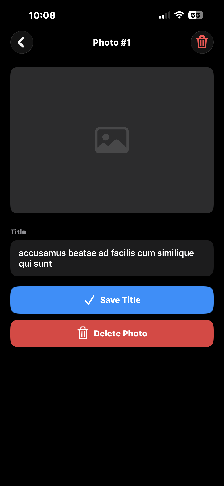
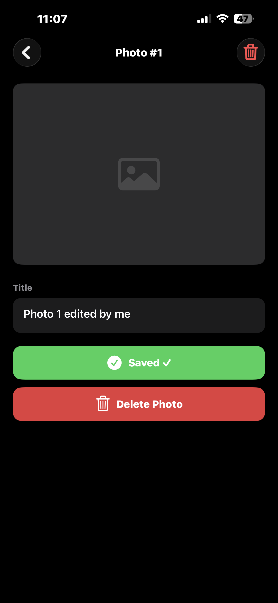
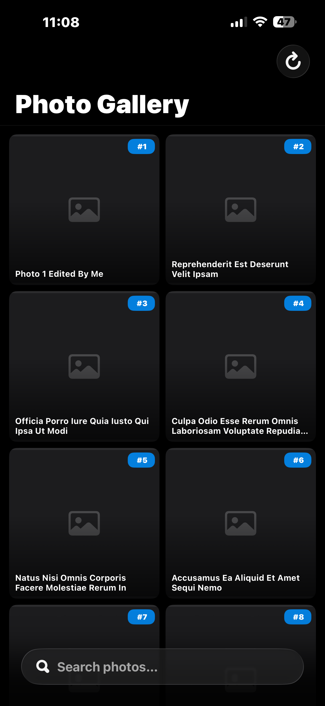
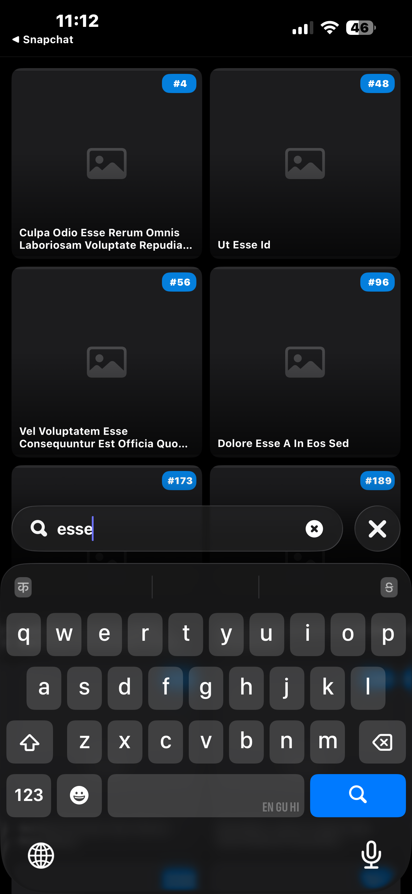
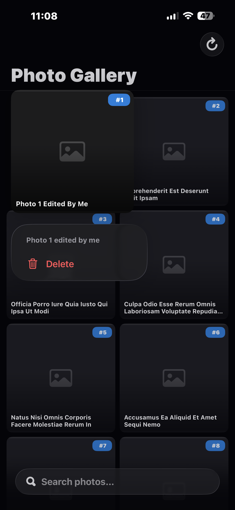
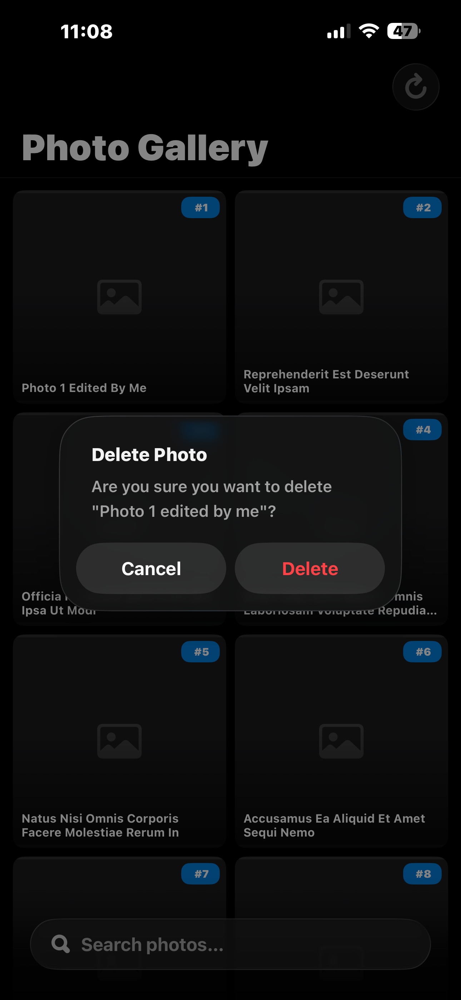
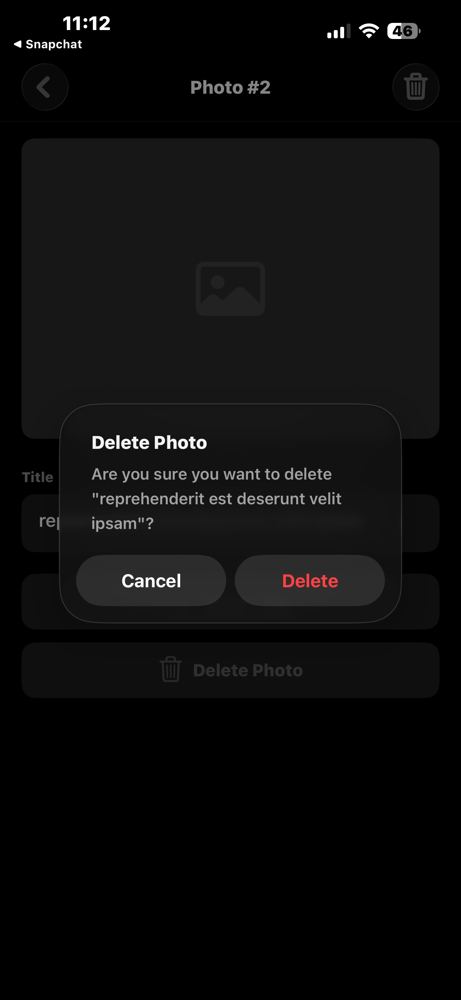
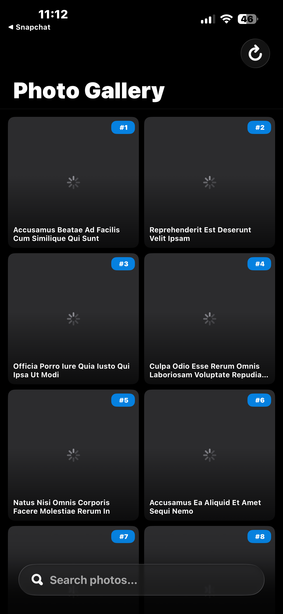

# 📷 Photo Gallery App

A native iOS photo gallery application built with Swift and UIKit, following the MVVM architecture pattern. The app fetches 5,000 photos from the [JSONPlaceholder](https://jsonplaceholder.typicode.com/photos) API, persists them locally with Core Data, and provides a fluid browsing experience with search, pagination, editing, and deletion.

---

## Screenshots

<table>
  <tr>
    <td align="center"><b>App Icon</b></td>
    <td align="center"><b>Gallery List</b></td>
    <td align="center"><b>Photo Detail</b></td>
    <td align="center"><b>Title Editable</b></td>
    <td align="center"><b>Title Updated</b></td>
  </tr>
  <tr>
    <td></td>
    <td></td>
    <td></td>
    <td></td>
    <td></td>
  </tr>
  <tr>
    <td align="center"><b>Search by Title</b></td>
    <td align="center"><b>List Delete (Swipe)</b></td>
    <td align="center"><b>List Delete Popup</b></td>
    <td align="center"><b>Detail Delete Popup</b></td>
    <td align="center"><b>Sync from API</b></td>
  </tr>
  <tr>
    <td></td>
    <td></td>
    <td></td>
    <td></td>
    <td></td>
  </tr>
</table>

---

## Features

| # | Feature |
|---|---|
| ✅ | Fetch 5,000 photos from JSONPlaceholder REST API |
| ✅ | Persist all photos locally via **Core Data** (programmatic model — no `.xcdatamodeld` file) |
| ✅ | **Offline-first**: load from Core Data on subsequent launches; only hit the network if the store is empty |
| ✅ | **Pagination**: display photos in pages of 40 using Core Data fetch offsets; load-more on scroll |
| ✅ | **Search**: real-time, case/diacritic-insensitive title search via NSPredicate |
| ✅ | **Sync**: force-refresh button wipes the local store and re-fetches all 5,000 photos |
| ✅ | **Photo Detail**: full-resolution image with async loading, spinner, and placeholder fallback |
| ✅ | **Edit title**: inline text editing with a shake animation on empty input; persisted to Core Data |
| ✅ | **Delete photo**: confirmation alert + animated cell removal; context-menu swipe from the grid |
| ✅ | **Image caching**: `NSCache` with a 100 MB / 150-item limit shared across cells and the detail screen |
| ✅ | **Empty state**: informative view with icon, message, and a "Sync Now" button |
| ✅ | **Error handling**: typed URLError messages, Core Data save/fetch/delete errors surfaced as alerts |
| ✅ | No third-party dependencies — 100% native Swift + UIKit |

---

## Requirements

| Tool | Version |
|---|---|
| Xcode | 15.0 or later (tested on Xcode 16.x) |
| iOS Deployment Target | iOS 16.0+ |
| Swift | 5.9+ |
| Device / Simulator | iPhone (any size) |

> **No CocoaPods, SPM packages, or Carthage dependencies.** The project opens and builds with zero setup beyond Xcode.

---

## Setup & Running

```bash
# 1. Clone the repository
git clone https://github.com/sagarmodi61/PhotoGalleryApp.git
cd PhotoGalleryApp

# 2. Open in Xcode
open PhotoGalleryApp.xcodeproj

# 3. Select a simulator or device (iPhone 16 recommended)
# 4. Press ⌘R to build and run
```

**First launch:** The app automatically fetches all 5,000 photos from the API and saves them to Core Data. This takes a few seconds on the first run — a loading spinner is displayed during this time.

**Subsequent launches:** Photos load instantly from the local Core Data store with no network request.

---

## Architecture

The app follows a clean **MVVM (Model – View – ViewModel)** architecture:

```
PhotoGalleryApp/
├── Models/
│   ├── Photo.swift              # NSManagedObject subclass (Core Data entity)
│   ├── PhotoDTO.swift           # Decodable value type (API / ViewModel boundary)
│   └── CoreDataManager.swift    # Singleton: Core Data stack + CRUD operations
│
├── ViewModels/
│   └── PhotoListViewModel.swift # Business logic, state machine, pagination
│
└── Views/
    ├── PhotoListViewController.swift   # Grid collection view, search, empty state
    ├── PhotoDetailViewController.swift # Full image, title editor, delete
    └── PhotoCell.swift                 # Reusable thumbnail cell + NSCache
```

### Data Flow

```
API (URLSession)
     │  JSON → [PhotoDTO]
     ▼
CoreDataManager ──── save/fetch/delete ────▶ Core Data Store
     │
     ▼ [PhotoDTO]
PhotoListViewModel  (ViewState<[PhotoDTO]>)
     │  onStateChanged / onLoadMoreCompleted / onUpdateError
     ▼
PhotoListViewController  ◀──── user actions ────
     │  navigation
     ▼
PhotoDetailViewController
```

### Key Design Decisions

| Decision | Rationale |
|---|---|
| **Programmatic Core Data model** | Avoids requiring an `.xcdatamodeld` bundle; the entity is defined in code in `CoreDataManager`, making the project fully self-contained. |
| **`ViewState<T>` enum** | Centralises loading/success/failure into a single callback rather than multiple boolean flags, reducing view controller complexity. |
| **Offline-first with explicit sync** | On launch the ViewModel checks `countOfPhotos()`; if > 0 it skips the network entirely. A dedicated sync button gives the user explicit control over refreshing. |
| **`NSCache` image cache** | A shared cache (`sharedImageCache`) across `PhotoCell` and `PhotoDetailViewController` avoids re-downloading images already fetched in the grid. |
| **`performBackgroundTask`** | All Core Data writes (save, update, delete) run on a private background context to avoid blocking the main thread. |
| **`UICollectionViewCompositionalLayout`** | Enables a clean 2-column grid with fractional sizing that adapts automatically to any screen width. |

---

## Error Handling

| Scenario | Behaviour |
|---|---|
| No internet / timeout | Specific `URLError` message (e.g. "No Internet Connection") shown in an alert |
| HTTP 4xx / 5xx | "Server returned an error (Status: NNN)" alert |
| JSON decode failure | "Failed to decode data. Please check for app updates." alert |
| Core Data store load failure | Error stored in `CoreDataManager.storeLoadError`; no crash — failure surfaced gracefully |
| Core Data save failure | Alert shown after photos are displayed (data visible but not persisted) |
| Core Data fetch failure | `Result<[PhotoDTO], Error>` returned to ViewModel; error surfaced to UI |
| Core Data update failure | `onUpdateError` callback fires; alert shown from detail VC or list VC |
| Core Data delete failure | "Delete Failed" alert with localised error description |
| Network failure + empty store | Empty state view shown instead of blank screen |
| Zero photos after search | Empty state view shown |
| Last photo deleted | Empty state view shown automatically |
| Double-present alert guard | `presentedViewController == nil` check prevents crashes from overlapping alerts |

---

## Assumptions

1. **Public API only** — `https://jsonplaceholder.typicode.com/photos` is used as-is. The app does not authenticate and does not implement POST/PUT/DELETE against the remote API (mutations are local-only).
2. **5,000 photos in a single request** — The API returns all records in one response. The app does not implement server-side pagination; client-side pagination (40 per page) is applied to the local Core Data result set.
3. **`id` as unique key** — Photos are deduplicated by their `id` field using Core Data uniqueness constraints with `NSMergePolicy.mergeByPropertyObjectTrump`.
4. **Title edits are local-only** — Saving a new title updates the local Core Data record only; it is not pushed back to the remote API.
5. **Delete is local-only** — Deleting a photo removes it from Core Data; the remote dataset is unaffected.
6. **No authentication / App Store submission** — No bundle ID signing, capabilities, or entitlements beyond what Xcode generates automatically. Set your own Team in project settings to run on a physical device.
7. **Thumbnail vs. full image** — The grid uses `thumbnailUrl` (150×150 px) from the API. The detail screen loads the full `url` (600×600 px). Both endpoints are external URLs from `jsonplaceholder.typicode.com`.
8. **iOS 16 minimum deployment** — `UICollectionViewCompositionalLayout` and `UIButton.Configuration` require iOS 14+. iOS 16 was chosen as a round-number minimum that covers the vast majority of active devices.

---

## Project Structure (File Tree)

```
PhotoGalleryApp/
├── .gitignore
├── README.md
├── Screenshots/
│   ├── gallery_and_detail.png
│   └── empty_state.png
├── PhotoGalleryApp.xcodeproj/
└── PhotoGalleryApp/
    ├── AppDelegate.swift
    ├── Info.plist
    ├── Assets.xcassets/
    ├── Models/
    │   ├── Photo.swift
    │   ├── PhotoDTO.swift
    │   └── CoreDataManager.swift
    ├── ViewModels/
    │   └── PhotoListViewModel.swift
    └── Views/
        ├── PhotoListViewController.swift
        ├── PhotoDetailViewController.swift
        └── PhotoCell.swift
```

---
